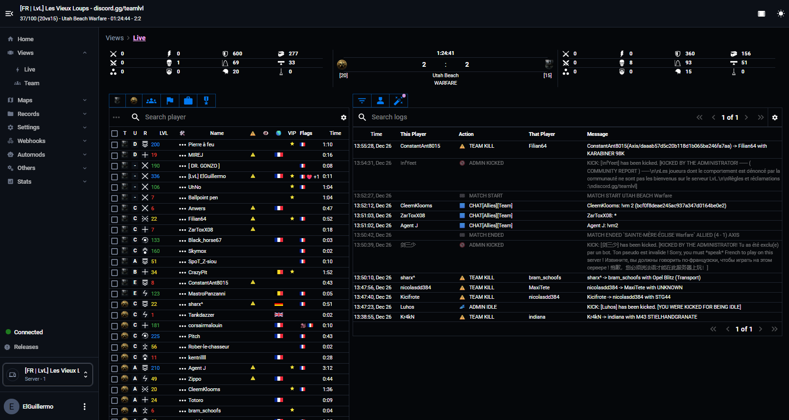

# Hell Let Loose Community RCON (CRCON)

An extended RCON tool for [Hell Let Loose](https://www.hellletloose.com/), meant to replace the official tool and go WAY beyond.

  

## Documentation

<table>
  <tbody>
    <tr>
      <th>Getting started</th>
      <th>User guide</th>
      <th>For the devs</th>
      <th>Help</th>
    </tr>
    <tr>
      <td valign="top" nowrap>
        ● <a href="https://github.com/MarechJ/hll_rcon_tool/wiki/Getting-Started-%E2%80%90-Presentation-and-features">Presentation and features</a> 
        ● <a href="https://github.com/MarechJ/hll_rcon_tool/wiki/Getting-Started-%E2%80%90-Requirements">Requirements</a> 
        ● <a href="https://github.com/MarechJ/hll_rcon_tool/wiki/Getting-Started-%E2%80%90-Installation#installing-crcon">Installation</a>
      </td>
      <td valign="top" nowrap>
        ● <a href="https://github.com/MarechJ/hll_rcon_tool/wiki/User-Guide-%E2%80%90-main-interface-%E2%80%90-Home">Main interface</a> 
        ● <a href="https://github.com/MarechJ/hll_rcon_tool/wiki/User-Guide-%E2%80%90-Admin-panel">Admin panel</a>
      </td>
      <td valign="top" nowrap>
        ● <a href="https://github.com/MarechJ/hll_rcon_tool/wiki/Developer-Guides-%E2%80%90-Overview---Project-Structure">Overview Project Structure</a> 
        ● <a href="https://github.com/MarechJ/hll_rcon_tool/wiki/Developer-Guides-%E2%80%90-Development-environment">Development environment</a> 
        ● <a href="https://github.com/MarechJ/hll_rcon_tool/wiki/Developer-Guides-%E2%80%90-CRCON-API">CRCON API</a>
      </td>
      <td valign="top" nowrap>
        ● <a href="https://github.com/MarechJ/hll_rcon_tool/wiki/Help-%E2%80%90-Common-issues-and-their-solutions">Common issues</a> 
        ● <a href="https://github.com/MarechJ/hll_rcon_tool/wiki/Help-%E2%80%90-Report-an-issue">Report an issue</a>
      </td>
    </tr>
  </tbody>
</table>

## Join us on Discord

For feedback, troubleshooting and information about updates and general Hell Let Loose hosting info :  
<https://discord.gg/rfTaA5HF>

## Support and contribute

Feel free to support and contribute to CRCON's development !  
The money will be used to reward developers and people who create video tutorials, demos, documentation, etc.  

| Paypal | Ko-fi |
| --- | --- |
|  |  |

You're an SQL wizard ? Dreaming in Python ? Eating frontends at breakfast ?  
- Any code contribution to the main branch (or external tools) will be greatly appreciated !

No coding skills ?
- You can help to enhance this [Wiki](https://github.com/MarechJ/hll_rcon_tool/wiki/) or produce video tutorials !  
- Translations are also very welcome : there are many people with no or limited English who use CRCON.
