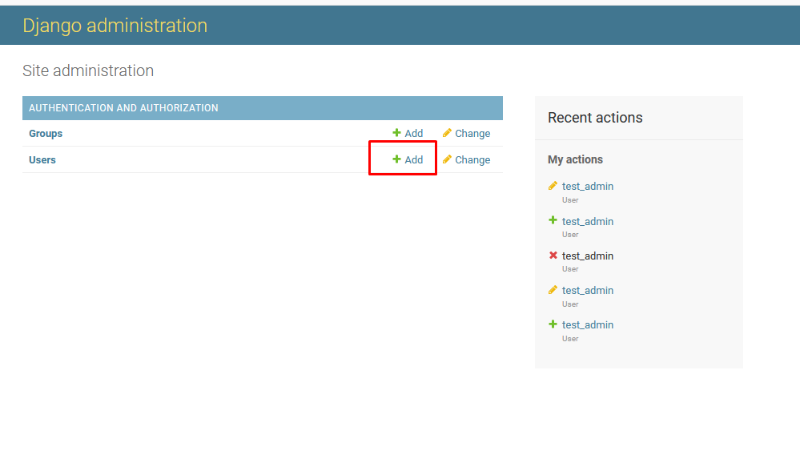
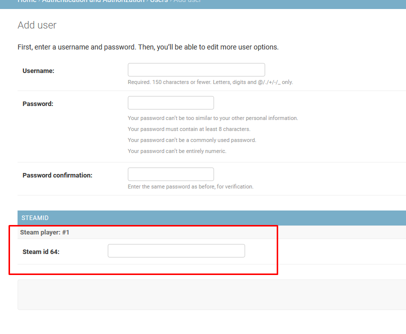
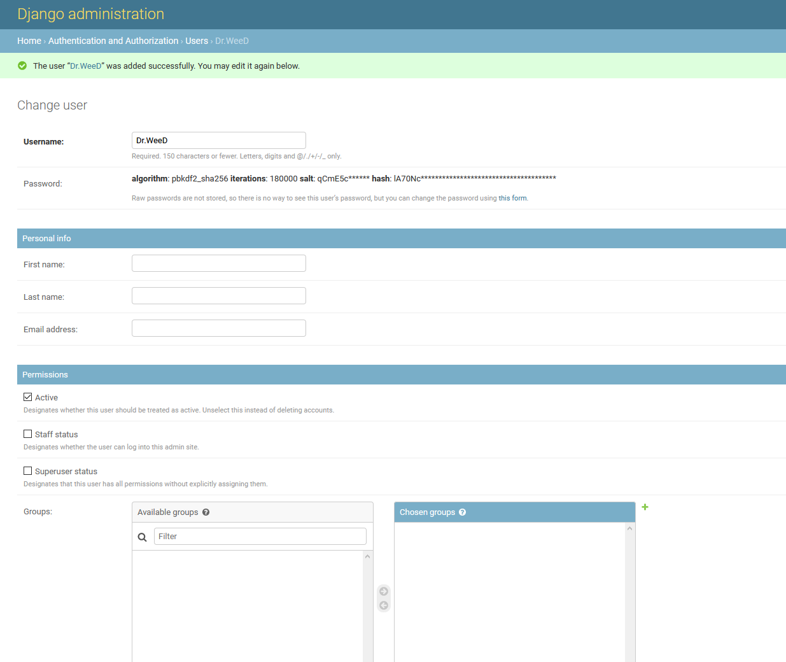
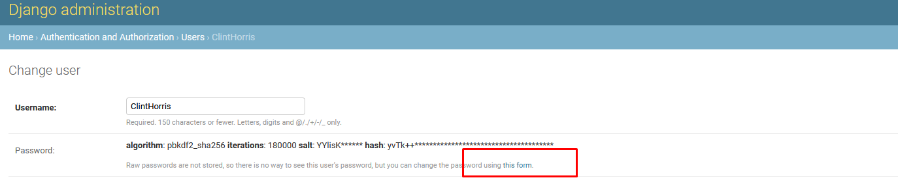
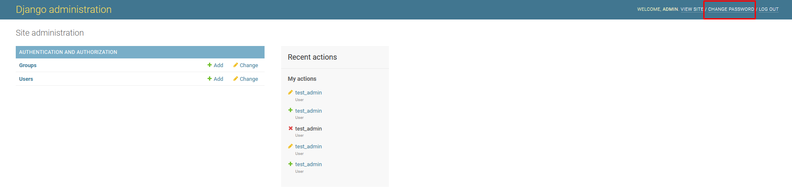

# Hell Let Loose (HLL) Community RCON (CRCON)

An extended RCON tool for Hell Let Loose, meant to replace the official tool and go WAY beyond.


[](https://github.com/psf/black)
[](README.zh.md)

[](https://ko-fi.com/T6T83KY8H)

Join us on Discord for feedback, troubleshooting and information about updates and general Hell Let Loose hosting info : <https://discord.gg/hZx6gn3>

## Included features

### Manage your games and players in realtime

- See all the players currently in game (live view with game logs or game view with players by squad/team):
  - Unique player IDs (steam 64 ID or Windows Store ID)
  - Steam profile (with API key configured) for steam players (country, bans, etc.)
  - VIP status
  - Current session (connection time, play time) and session history (total play time, number of sessions, etc.)
  - Current level, team, squad, role and loadout
  - Current combat/attack/defense/support scores
  - Current kills and deaths numbers and miscellanous other statistics like kills per minute
- Individual player actions or grouped (multiple players at the same time)
  - `message` the player in game
  - `team switch` the player immediately or when the player dies
  - `punish` (kill in game), `kick`, `temp ban` (you choose the duration) or `perma ban` with a message
  - `watch` players to receive a Discord notification (ping) when they connect
  - `flag` players (helps to find some users quickly in the player history  
  or activate options used by moderation bots)
- Recording of you map history, you see which map were played and how long they lasted
- Maintain individual (by CRCON account) or shared message templates for punishments, etc.

- A live view that shows you all currently connected players and all of the game server logs, as well as filter them by `action` or `player`:
  - Player connections/disconnections
  - Kills, team kills
  - Messages sent to players from CRCON
  - Team/unit chat
  - Automatic game server actions (idle kick, high ping kick, etc.)
  - Admin actions (kick, temp bans, etc.)

### Admin Accounts / Audit Trail

- Individual accounts per admin so you never need to share your game server RCON password
- Fine grained permissions that allow you to restrict exactly what an admin can do
  - Can be used to create read only accounts (for instance if you run events and want to allow streamers/etc. to view the kill feed)
  - Can create a tiered admin system (for instance if you want to allow people monitoring seeding to only be able to kick players but not ban them)
- Audit logs showing which accounts performed which actions for accountability
- Optional Discord integration to send audit actions to a webhook

### API / API Keys

- An ever growing number of API endpoints to allow you to write tools without having to fully implement the RCON protocol yourself
- Ability to generate/authenticate with API keys for easier tool access

### Manage your players database

- History of all players who have connected
  - All names they've played with
  - All messages they have received in game (some automated messages are not saved)
  - Their sessions (connect/disconnect times, play time, etc.)
  - Punishments (kicks, bans, etc.)
- Filter by player name, player ID (steam/windows store IDs), etc.
- Apply actions to players even if they are not online anymore

- Ban (blacklist) people, even if those who have never played on your server.
- Permanent logs : search through the entire history of the game logs of your server, export logs as CSV.
- Bans, blacklist and VIP backup/restore

### Automatic server settings

Settings that can be applied based on different conditions (time of day, number of connected players, current map, number of connected admins, etc.)
Change most (but not all) game server/CRCON settings, including but not limited to :  

- `broadcast` and `welcome` messages ;
- game server settings (`teamswitch cooldown`, `autobalance threshold`, `idle autokick`, `maximum ping`, `max queue length`, `VIP slots`, `vote kicks`, `profanities` in chat) ;
- `vote for next map` ;
- Map rotations (late night or seeding rotations, etc.) ;
- Map shuffle.

### Automatic Moderation

#### Auto Mods

- Automatic enforcement of various rules (within RCON limitations) with the ability to `warn` (message the player), `punish` and/or `kick` in a progressive fashion based on number of warnings/time between warnings
- Level Enforcement
  - Remove players from the server who are above or below level limits
  - Forbid players from playing roles (Commander, Tank Commander, Squad Leader, etc.) who are above or below level limits
- Squad Leader Enforcement
  - Forbid squads without squad leads
- Seeding Enforcement
  - Ban weapons
  - Ban roles
  - Prevent (very limited due to RCON limitations) attacking objectives (for example, only allow the middle point to be contested)
- No Solo Tank Enforcement
  - Forbid players from being in a tank squad without other players (can't determine if the squad is locked due to RCON limitations)

#### Miscellaneous automatic enforcement of rules

- Set [regular expressions](https://regex101.com/) to remove players based on their name, for example:
  - Remove players with only numbers in their name
  - Remove players without at least one character (A-Z or a-z) to avoid all symbol names
  - Player names that contain words (ie : "nazi", "fucker", etc.)
  - Any regular expression you can craft should work!
- Remove players with names that will not work properly with RCON commands because of RCON bugs:
  - Player names that end in white space (or end in white space after the game trims the name to RCONs 20 byte maximum)
  - Player names that (due to an RCON bug) have multi byte unicode code points that the game server chops off (pineapple names)
- Remove game pass players on connect (if your GSP hasn't exposed the file to turn it off at the server level)
- Automatically perma ban players who only team kill after connecting
- Automatically perma ban steam players with X number of VAC and/or game bans within Y days (with a Steam API key configured)

### Chat Commands

- Ability to create your own custom commands that players can trigger with chat messages.
- A limited (but growing) number of variables can be used in the message.
- For example, you can create commands like :  
  - `!Discord` to display your Discord clan url,  
  - `!killer` to display the name of your last killer

### Discord Integration

- Create [Discord webhooks](https://support.discord.com/hc/en-us/articles/228383668-Intro-to-Webhooks) to send information from CRCON to your Discord server
  - Kills/Team kills
  - Player chat
  - Admin cam usage
  - Various automated actions (auto mods, etc.)
  - Admin actions (audit trail)
  - Live scoreboard (current map, time remaining, number of players connected, top kills, etc.) that updates in real time
- Admin pings that will notify (ping) user or roles when certain words are used (`!admin`, etc.)
- Ability to send any log action (map start, admin kick, etc.) with optional user/role notifications

### Public stats webpage

- Live game
- Historical games (bookmarkable)

### Power users features

- Supports multiple game servers within a single CRCON install
  - CRCON admin accounts/permissions are shared (and can't be limited by game server)
  - Shared player history
  - Shared blacklist (permanent bans stored in CRCON)
  - Apply actions (except permanent bans due to the blacklist) on a server by server basis, or forward actions to the other servers to keep them in sync
- Create your own plugins and manage them from the Services section of the settings page

## Some images

### Manage your games and players in realtime


### Manage your players database


### Automatic server settings


### Permanent logs


## Features to come (maybe)

- Leaderboard and all time stats

## Installation

### Minimum skills

"I don't know anything about VPS, Linux, console commands, coding and such..."

Relax :

- You'll only need *very limited* shell skills. Every step is explained in detail, with examples.
- You'll find even more explanations on the [Wiki](https://github.com/MarechJ/hll_rcon_tool/wiki). But as it is not versioned, it may be a little out of date with the newer CRCON release, or contain features/informations that is not applicable to you if you are running an older one.
  - Wiki updates are highly appreciated ! This is an easy way to contribute if you don't have any programming skills ;
  - Translations are also very welcome, there are many people with no or limited English who use CRCON.
- Most shell commands/error messages can be Googled, and a *lot* of usual questions already found an answer on the CRCON's Discord : search for them !
- Please respect people's time and energy and try first to search Google/Discord for a solution.  
If you're really stuck, you should [ask for help](https://discord.com/channels/685692524442026020/685695097349734469).

### Install it on a VPS, not on your home PC

CRCON is designed to run permanently (24/7) as a website,  
being accessible on the Internet for your players (to access public stats) and game server admins (to manage the games).

So, we strongly suggest you rent a cheap VPS to host your CRCON !

Why is it designed this way :

- Your users only need a web browser to access CRCON ;
- You don't have to give access to the game server's provider services or RCON password  
(you should never give these, as any admin action taken outside CRCON won't be logged) ;
- It provides a centralized database for game server data (logs, etc.) ;
- It allows to keep a record/log of all admin actions.

If you still decide to install it on a home computer, keep in mind you'll have to :

- run your computer 24/7  
*Think about noisy fans, hardware maintenance and electricity bills.  
Sum it up : renting a low-end VPS will be cheaper* ;
- open your home internet access and let people connect to your computer.  
*This requires real network management knowledge and could lead to security risks.*

### Hardware requirements

- Minimum : 2 CPU cores and 6GB of RAM.
- **Recommended : 4 CPU cores and 8GB of RAM.**
- Regarding drive space, the CRCON database of a game server where 95+ players connect for 10 hours per day may grow up to 20 GB in a year. As it's not easy to shrink it, you are advised to select an hosting plan with >50 GB of storage.

> [!TIP]
> Some VPS providers rent this type of services for ~$5-10/month.  
> Some VPS providers even offer free installation of linux distributions in which Docker is already activated. Search/ask for it !

> [!NOTE]
> You *can* run CRCON on as little as 3.x GB of RAM, but as it's not easy to increase the amount of RAM your VPS has, it's better to pad it a little bit. The more game servers you manage within a CRCON install, the more RAM/CPU/storage you'll need.

### Software requirements

In theory, you can install CRCON on any operating system/architecture that runs [Docker engine](https://docs.docker.com/engine/) and Docker [Compose](https://docs.docker.com/compose/) plugin.  
Unless you have a really good reason not to do so, you should use Linux.  
This will ensure better tech support when you'll search for help on Google, as Docker and CRCON userbases are very scarce on Windows.  
If you're unfamiliar with Linux, you are advised to pick a VPS plan using a popular distribution, like [Ubuntu server](https://ubuntu.com/server) or [Debian](https://www.debian.org/).

If you *really* need to run it on Windows and have no other option, try using [Windows Subsystem for Linux](https://learn.microsoft.com/en-us/windows/wsl/install).

> [!NOTE]
> We provide pre-built Docker images for `linux/amd64`, `linux/arm64` and `linux/arm32`.  
If you use a different operating system or architecture, you will need to build your own images.

#### 1. git

*(optional but highly recommended)* : <https://git-scm.com/downloads>  

If you don't use `git`, you'll have to manually download and install the CRCON releases in .zip format, and you won't be able to update your CRCON as easily as with `git`)
  
You can check if git is installed by entering this command in your terminal :  

```shell
git version
```  

You should get a reply like `git version 2.34.1`
  
If not : install `git` by entering this command :  

```shell
apt install git-all
```

#### 2. Docker Engine

(Community edition) : <https://docs.docker.com/engine/install/>  

> [!WARNING]
> You can also try to use [Docker Desktop](https://www.docker.com/products/docker-desktop/), but you may encounter issues with nested virtualization, depending on your computer/server/VPS.

You can check if `Docker engine` is installed by entering this command :  

```shell
docker version
```  

You should get a (multiline) reply like `Client: Docker Engine - Community - Version 26.1.0...`
  
If not : install `Docker` by entering this command :  

```shell
apt install docker.io
```

#### 3. Compose plugin for Docker

Source : <https://docs.docker.com/compose/>  
  
> [!CAUTION]
> `docker-compose` has been deprecated in july 2023, errors **will** occur if you try to use it.
  
You can check if Docker `Compose` plugin is installed by entering this command :  

```shell
docker compose version
```  

You should get a reply like `Docker Compose version v2.26.1`
  
If not : install the Docker `Compose` plugin by entering this command :  

```shell
apt install docker-compose-plugin
```

#### 4. Any text editor that supports syntax highlighting

*(Optional but **highly** recommended)*

The instructions below use `nano`, which is a tiny shell based editor that can be difficult to work with.  
  You should try [Visual Studio Code](https://code.visualstudio.com/), which is a free and fully featured text editor that allows you to [remotely edit files over SSH](https://code.visualstudio.com/docs/remote/ssh) which is very handy when editing files on your VPS.

## Install steps

Stay cool and follow the drill. It's a simple installation, many not-so-technical people managed to do it, so you probably can too :)

> [!TIP]
> All the commands given below are meant to be entered in a Debian-based (like Ubuntu) Linux terminal.

---

### 1. Download CRCON

Using an SSH client (*don't know which one to get ?* Try PuTTY : <https://www.chiark.greenend.org.uk/~sgtatham/putty/>),  
**log in as root** into your distant Linux, using the SSH credentials given by your VPS provider.

Enter these commands in the terminal (*press [Enter] to validate*) :

Download the CRCON files :

```shell
git clone https://github.com/MarechJ/hll_rcon_tool.git
```

Get in the newly created CRCON dedicated folder :

```shell
cd hll_rcon_tool
```

---

### 2. Edit the environment config file

Now, you're going to create and edit an `.env` file, in which you'll tell CRCON how to connect to your HLL game server(s).  
Here we'll use **nano**, a simple text editor that runs in text mode.  
*You can use any other tool you're used to, either local or getting the file from a SFTP connection.*

> [!CAUTION]
> Do not edit `default.env`.  
> The file you're about to create must be named `.env` or Docker will not detect it.  

Make a copy of the environnement config file template :

```shell
cp default.env .env
```

Install the nano text editor :

```shell
apt update && apt install nano
```

Launch nano to edit the .env file :

```shell
nano .env
```

> [!TIP]
> In nano, you can move the cursor with the arrow keys.  

You do not have to change all the values. Only these 5 are mandatory :

#### 2-1. Choose a password to give CRCON access to its database  

```Dotenv
HLL_DB_PASSWORD=anythingwithoutanyspace
```

> [!TIP]
> No need to remember/note it : you'll never have to enter it anywhere.  
  Check the comments in the `.env` for restricted characters, such as `%`.

> [!CAUTION]
> Do not change the password after CRCON has been started at least one time : your database would not be accessible.

#### 2-2. Invent a string that will be used to scramble users passwords

The longer the better.

```Dotenv
RCONWEB_API_SECRET=anythingwithoutanyspaceordollarsign
```

> [!TIP]
> You may want to back this up separately. If you lose it, all of your admin accounts will be invalidated and need their passwords reset.

> [!CAUTION]
> Do not change the string after CRCON has been started at least one time : existing passwords would be invalidated.

If you want to manage more than one game server, repeat the steps below for the 2nd, 3rd, etc.

#### 2-3. **RCON IP**

As provided by the game server provider. This may be not the same as the game server IP.

```Dotenv
HLL_HOST=123.123.123.123
```

#### 2-4. **RCON port**

As provided by the game server provider. This is not the same as the game server port.

```Dotenv
HLL_PORT=12345
```

#### 2-5. **RCON password**

As provided by the game server provider.

```Dotenv
HLL_PASSWORD=yourrconpassword
```

> [!IMPORTANT]
> Triple-check there is no space before/after the `=` signs, nor in the values you've set.

- save the changes with `Ctrl`+`o` (then type `y` to validate)  
- exit nano with `Ctrl`+`x`

---

### 3. Create a Docker Compose File

`docker compose` commands need a special file to know what to do.  
This file will be created from a template.  
If you intend to manage more than one HLL game server, you'll have to modify it to fit your needs.

The `docker-templates/` folder contains two example templates :  

- `one-server.yaml` for a single game server ;
- `ten-servers.yaml` for up to 10 game servers.  

> [!CAUTION]
> Do not edit these files.

For `docker compose` to detect the file, it needs to be in project's root and [named](https://docs.docker.com/compose/compose-application-model/) `compose.yaml`.

#### 3-1. Managing a single game server

Make a copy of the `one-server.yaml` compose template :

```shell
cp docker-templates/one-server.yaml compose.yaml
```

That's it ! Go to step 4 ([Run CRCON for the first time](#4-run-crcon-for-the-first-time)).

#### 3-2. Managing two or more game servers

Make a copy of the `ten-servers.yaml` compose template, then edit the newly created `compose.yaml` to fit your needs.

You can either :  

- (easier) copy `ten-servers.yaml` and delete the parts about servers you don't need (see below).

  ```shell
  cp docker-templates/ten-servers.yaml compose.yaml
  ```

- copy `one-server.yaml` and add more servers in it (look at `docker-templates/ten-servers.yaml` for examples)  

  ```shell
  cp docker-templates/one-server.yaml compose.yaml
  ```

There are two places that need to be updated for the `compose.yaml` to work properly, according to your servers number :

##### 3.2.1 Networks

The `networks` section (at the top) **must** contain a definition for each server.

Add a network for each server you are using (look at `docker-templates/ten-servers.yaml` for examples)

```yaml
  networks:
    common:
    server1:
    server2:
    server3:
```

> [!NOTE]
> If you are no longer managing all the defined game servers, you can delete their dedicated networks.  
> Failing to do so won't hurt anything : it will just create extra unused networks.

> [!CAUTION]
> Do not remove the `common:` network.

##### 3.2.2 Services

The `services` section defines what containers Docker will actually start when you run commands like `docker compose up -d`, so you need to add a service definition for each server you are willing to run (or delete the ones you don't use).

**For example**, if you used `one-server.yaml` as your starting template for `compose.yaml` and you wanted to add a 2nd server, you would copy the appropriate section from `docker-templates/ten-servers.yaml` and add it to your `compose.yaml` :

```yaml
########### SERVER 2  #############
  backend_2:
    <<: *backend
    environment: &env_2
      <<: *backend-env
      SERVER_NUMBER: ${SERVER_NUMBER_2}
      HLL_HOST: ${HLL_HOST_2}
      HLL_PORT: ${HLL_PORT_2}
      HLL_PASSWORD: ${HLL_PASSWORD_2}
      HLL_REDIS_DB: ${HLL_REDIS_DB_2}
      HLL_REDIS_URL: redis://${HLL_REDIS_HOST}:${HLL_REDIS_HOST_PORT}/${HLL_REDIS_DB_2}
      RCONWEB_PORT: ${RCONWEB_PORT_2}
      PUBLIC_STATS_PORT: ${PUBLIC_STATS_PORT_2}
      PUBLIC_STATS_PORT_HTTPS: ${PUBLIC_STATS_PORT_HTTPS_2}
      GTX_SERVER_NAME_CHANGE_USERNAME: ${GTX_SERVER_NAME_CHANGE_USERNAME_2}
      GTX_SERVER_NAME_CHANGE_PASSWORD: ${GTX_SERVER_NAME_CHANGE_PASSWORD_2}
      SENTRY_DSN: ${SENTRY_DSN_2}
    hostname: api_2
    networks:
      common:
      server2:
        aliases:
          - backend
  supervisor_2:
    <<: *supervisor
    environment:
      <<: *env_2
    depends_on:
      backend_2:
        condition: service_healthy
    networks:
      common:
      server2:
        aliases:
          - supervisor
  frontend_2:
    <<: *frontend
    ports:
      - ${RCONWEB_PORT_2}:80
      - ${RCONWEB_PORT_HTTPS_2}:443
      - ${PUBLIC_STATS_PORT_2}:81
      - ${PUBLIC_STATS_PORT_HTTPS_2}:444
    depends_on:
      backend_2:
        condition: service_healthy
    networks:
      common:
      server2:
```

> [!CAUTION]
> You have to use the appropriate server numbers.  
If you use the same server number twice, only one of them will start and you **will** encounter issues.

> [!CAUTION]
> You need to be **very careful** and match the **indentation levels** appropriately or Docker will not be able to read the file.

---

### 4. Run CRCON for the first time

CRCON is now ready to start and connect to your HLL game server(s).

> [!WARNING]
> Do not think it's over yet, as we now have to configure CRCON's users and secure the default admin account.

> [!NOTE]
> Launch process will display a *lot* of scrolling text.  
Don't panic, as you do not have to read/do anything. Just watch the magic.

Enter this command :

```shell
docker compose up -d --remove-orphans
```

If everything went well, you will see output similar to (this is an example for a single game server and edited to fit):

```shell
❯ docker compose up -d
[+] Running 8/8
 ✔ Network hll_rcon_tool_common            Created  0.1s
 ✔ Network hll_rcon_tool_server1           Created  0.1s
 ✔ Container hll_rcon_tool-redis-1         Healthy  0.2s
 ✔ Container hll_rcon_tool-postgres-1      Healthy  0.2s
 ✔ Container hll_rcon_tool-maintenance-1   Healthy  0.1s
 ✔ Container hll_rcon_tool-backend_1-1     Healthy  0.1s
 ✔ Container hll_rcon_tool-supervisor_1-1  Started  0.1s
 ✔ Container hll_rcon_tool-frontend_1-1    Started  0.1s
```

If any of the containers report an `Error` status, and/or if you see messages about `Unhealthy` services, something is misconfigured.  
First thing to check :  

- one game server :  
  - double check all the values in `.env` ;
  - ensure you created `compose.yaml` from `docker-templates/one-server.yaml` (not `docker-templates/ten-servers.yaml`).
- more than 1 game server :  
  - double check all the values in `.env` ;
  - you may have extra servers in `compose.yaml` that aren't configured in `.env`.

---

### 5. Get in the CRCON UI

Your CRCON user interface can be reached from all over the world, in any web browser.

Each game server is accessed separately, pay attention to the `RCONWEB_PORT` values in your `.env` for each game server.

For example : **by default**, you can reach game server 1 on <http://yourVPSIP:8010/>  
(substitute the IP address of your VPS for `yourVPSIP` in the URL).

- Enter your server's URL in a web browser ;  
- Click on `LOGIN`, in the top menu  
*The default credentials are `admin`/`admin`* ;

> [!WARNING]
> Do not touch anything yet. You'll have plenty of time to play with the different tools later.

---

### 6. Prepare to configure users

We **MUST** change the admin's default password, as it is insanely insecure !

Due to inner security checks, we need to declare the VPS IP/port as "secure" to be able to enter the users management tool.  
Failing to do so **will** lead to `CSRF errors` when accessing the admin panel.

- In the `SETTINGS` menu, click on `CRCON settings` submenu  
  or directly get to <http://yourVPSIP:8010/#/settings/rcon-server>

  You'll see a large editable textarea.  
  The strange code in it is a config text, formatted in JSON.  
  Stay cool : for the time being, we only are going to change a single line in it.

- Modify the `server_url` line, entering your CRCON URL (ie : `http://yourVPSIP:8010`).  
  You must have quotation marks `"` around the url, and a comma `,` as the final character on the line.

```json
"server_url": "http://123.123.123.123:8010/",
```

- Click on the `SAVE` link, located below the textarea *(a green confirmation flag should pop in the top-right corner of the window).  
If a yellow or red flag pops in, you have a syntax error in your code : watch the example above to get it right*

---

### 7. Restart CRCON

Yes. Restart it. This may sound strange, but it is mandatory :  
to be taken in account, the `server_url` value you've just set has to be read during the CRCON Docker containers start.

```shell
docker compose restart
```

---

### 8. Configure users

Now you can get into the CRCON users management tool, located at : <http://yourVPSIP:8010/admin>

> [!NOTE]
> You should be already logged in. If not, the credentials are still `admin`/`admin`.

#### Add a new user

Click on the `+ Add` link.



Fill the `Add User` form  
Don't forget to enter the user's Steam ID (see image below) : it will be used by CRCON to identify this user as an admin.



Click on the `SAVE` link.

Once the user is created, you'll end up on that page :



> [!WARNING]
> Don't forget to give yourself the `Superuser status` and `staff status` if you intend to disable the `admin` account !

> [!NOTE]
> Users won't be allowed to change their password by themselves unless you check `staff status` on their profile.

To change the password of a user, click on its name, then on this link (see image below) :



You also can change *your* current password using the dedicated link (top-right red square below) :



#### Change admin's default password

- click on the page title (`Django administration`) to get back to the main page.  
*(This is the same as going to <http://yourVPSIP:8010/admin>)*
- click on `Users`, then on `admin`.
- Change the admin's default password  
(you also can disable admin's account by unchecking the `Active` status,  
just make sure there's another user having `Superuser status` and `staff status` activated)
- Click on the `SAVE` button

---

### 9. Basic configuration is over

🎉 Yes ! You did it ! You now have a fully working and secured CRCON ! Congratulations !

Take your time to explore all the menus and commands.

You'll find a lot of things to customize in the `SETTINGS` menus.  
(Most of the settings are described/explained on their own page.  
There is a lot of questions/answers about them on Discord, too).

We *know* the user interface isn't always intuitive :/  
Someone is actually working on a tremendous new version (thanks @Dorf !).

If you have any question (or just want to come and say hi), feel free to join us on Discord.

Have fun !

> [!NOTE]
> Feel free to support CRCON's development (thanks !).  
The money will be used to reward contributing developers and people who create video tutorials, demos, documentation, etc.  
> [](https://www.paypal.com/donate?hosted_button_id=56MYGQ2966V7J)

---

## Update to the latest version

Please join the CRCON Discord and follow [announcements](https://discord.com/channels/685692524442026020/693632529025990676).  
Sometimes, update instructions vary from standard.  
If you are updating from an older version, you should review the announcements in order and make any non-standard changes in order.

### Normal (most) updates

- Pull the changes from github

  ```shell
  git fetch --tags
  ```

- Check out a tagged release

  ```shell
  git checkout v9.4.1
  ```

- Get the newest Docker images

  ```shell
  docker compose pull
  ```

- Restart your containers

  ```shell
  docker compose up -d --remove-orphans
  ```

You also can download the [latest zip release](https://github.com/MarechJ/hll_rcon_tool/releases/latest) and install it manually (NOT recommended)

> [!NOTE]
> If you get `git` error messages when you pull, you have to resolve these before you can upgrade.  
(Unless you have been changing files, this should never happen).  
  It's important you get the sources every time, or at least the Docker compose files, as new dependancies might have been introduced.

## Downgrade (in case of issue) to a previous version

Check the available versions numbers on Docker hub (or Github releases) :  
<https://hub.docker.com/r/cericmathey/hll_rcon_tool/tags>  
<https://github.com/MarechJ/hll_rcon_tool/releases>

Edit your `.env` file and change `TAGGED_VERSION` from `latest` to a specific tagged release  
(it **must** match the release tag on Docker hub):

```shell
TAGGED_VERSION=9.4.1
```

Then restart

```shell
docker compose pull
docker compose up -d --remove-orphans
```

## How to use

(Demo video coming soon)

There's a public endpoint available to anybody without password on <http://yourVPSIP:7010/api/scoreboard>

See [User Guide](USERGUIDE.md) for more information on how to use certain features of the app.

## For power users

### Multiple Game Servers

You can use one CRCON for multiple game servers, or have separate CRCONs for one (or more) game server(s), but they need to be set up differently (see below).
If you run multiple game servers (for instance US west, US east and/or an event server), it makes more sense to do *one* CRCON install, rather than separate CRCONs for each game server.

#### One CRCON to manage multiple game servers

When using a single CRCON installation for multiple game servers, all of your admin accounts will have equal access to all of them, and all of your data will be stored in a single database.

This will make it difficult to separate your servers in the future (if you are trying to use one CRCON for multiple communities by sharing a VPS) without starting from scratch and losing data.

You will need to update your `compose.yaml` to have a definition for each extra server you want to run.  
You can copy and paste each extra server from `docker-templates/ten-servers.yaml` (refer to the installation guide below for specifics)

#### Multiple CRCON installations

Please [see the Wiki](https://github.com/MarechJ/hll_rcon_tool/wiki/Multiple-CRCON-Instances) for instructions on managing multiple installs on the same host machine.

## Building your own Docker images

Docker images are hosted on [Docker Hub](https://hub.docker.com/r/cericmathey/hll_rcon_tool), but if you're running a fork, have made local modifications, are running CPU architecture we don't have pre-built images for, or the release you want isn't available for some reason, you can build your images locally.

### Set environment variables

If you don't already have a `.env` file created use `default.env` to make a template, otherwise the build will fail due to unset environment variables:

```shell
cp default.env .env
```

If you don't have a `.env`, you must set the following environment variables to something, or the build will fail with an error that looks like `invalid tag ":": invalid reference format` (just use a copy of `default.env`):

```shell
BACKEND_DOCKER_REPOSITORY=
FRONTEND_DOCKER_REPOSITORY=
TAGGED_VERSION=
```

### Create a Docker Compose file

Refer to the installation guide if you do not already have a `compose.yaml` file created.

### Build the images

Building the images can take a significant amount of time and you must be connected to the internet for it to fetch resources.

```shell
docker compose build
```

### Run it

Once the images are built (which can take a considerable amount of time depending on your hardware specs), and once it's configured properly (see the installation part of this README), then simply enter this command to create the containers :

```shell
docker compose up -d --remove-orphans
```

If you don't want to use `docker compose` (which you really should, it's just easier), then you would have to properly set/create/run the Docker containers yourself. Please consult Docker's documentation.

## Development environment

Pull requests are always welcome ! It can be a bit tricky setting up a local environment and it is hard to contribute without having a HLL game server to connect to (and it's impossible to host one yourself, as T17 won't release the server files).

### Overview / Project Structure

The project is split up into several main components :

- `backend`, split into two major components :
  - `rcon` package :  
    Handles the implementation of the [HLL RCON protocol](https://gist.github.com/timraay/5634d85eab552b5dfafb9fd61273dc52) and implements most of the core behavior/features that CRCON has.
  - `rconweb` package, which is a `Django` web (`WSGI`) application :  
    Handles all of the web portions (URL routing, authentication, sessions, etc.) once a HTTP request has been received by `nginx` in the `frontend`.
- `frontend` :  
    A combination of `nginx` (used as a reverse proxy) and `gunicorn` web servers that handles all of the HTTP requests and serves all of the responses.  
    The flow is `incoming request` -> `nginx` -> `gunicorn` -> `nginx` -> `outgoing response`.  
    `nginx` handles serving all of the static content like HTML/css/images, and `Django` processes all of the API calls that return dynamic content.
- `supervisord` :  
    Manages starting and restarting all of the optional/non optional (if you want a fully functioning CRCON) services, all of which are implemented in the `rcon` package or are standalone programs like `rq` or `cron`.
- `maintenance`, `redis` and `postgres`, that is shared across each image.

It is intended to be run using Docker and `docker compose`.  
Each CRCON install can manage multiple game servers, and each game server (server 1, server 2, etc.) has its own set of images (backend_1, frontend_1, supervisor_1, etc.).

#### `rcon` package

The `rcon` package relies on several core classes.

`rcon.connection.HLLConnection` handles connecting to the game server (IP, port and RCON password), `xor` [encoding/decoding](https://gist.github.com/timraay/5634d85eab552b5dfafb9fd61273dc52#protocol-1) content and sending/receiving raw bytes over TCP sockets.

`rcon.commands.ServerCtl` is the parent class of `Rcon` and handles managing a pool of `HllConnection` instances, validating/converting low level stuff (like stripping tabs from user generated content for HLL tab delimited lists), automatically retrying commands that fail, and sending the raw commands (such as `get profanity`) to the game server.

`rcon.commands.ServerCtl` can be used without any database or redis connection, but is of limited use and not published separately.

`rcon.rcon.Rcon` inherits from `ServerCtl` and handles parsing/structuring the raw text received from the game server into meaningful data, interacting with the database, caching command results, etc.

`CRCON` is not an async (`ASGI`) web app (`async`) or multi core (`multiprocessing`), but it does support running multiple slow (to the game server) requests simultaneously through [thread pools](https://docs.python.org/3/library/concurrent.futures.html).

The `rcon` package also contains the implementation of most of CRCNs features, if you're not sure how something works, identify which API endpoint is doing the action, look in the URL routing in `rconweb` and you can see what parts of `rcon` are imported.

#### `rconweb`

The `rconweb` package is a Django web app that actually exposes all of the URL endpoints and imports from `rcon` as needed when interacting with the game server versus the local CRCON backend (`redis`, `postgres`, etc.).

Some endpoints are explicitly exposed, but some (`Rcon` methods) are implicitly exposed (`rconweb.api.views.expose_api_endpoint`).

#### `supervisord`

Due to the fact that Python is notoriously [single threaded](https://stackoverflow.com/questions/1294382/what-is-the-global-interpreter-lock-gil-in-cpython), some core parts of CRCON have been broken out into services that run in their own Python interpreter, so they can take advantage of multiple cores/threads on the system.  
This also enables faster network access since each individual network request (to the game server, steam API, Discord, etc.) blocks until completion.

Other portions are optional services and have been split so users have more control over what runs.

The services are managed by [supervisord](http://supervisord.org/) and run inside of their own (`supervisor`) container.

#### `redis`

[Redis](https://redis.io/) is used for two reasons in CRCON, caching and interprocess communication.

Every round trip to the game server can be significantly slow (in computing terms) and induces some amount of overhead on both CRCON and the game server.

Some commands are cached, even if they have a very low cache time (such as retrieving logs from the game server) to avoid constantly reprocessing info on very short time frames and others are on a longer cache time because they rarely (if ever) change (such as the list of available maps from the game server).

This also condenses requests that occur almost simultaneously to be reduced to a single request that makes it to the game server, the remaining requests will be resolved from the cache (unless they happened before the first request has completed and cached its results).

Many portions of CRCON run in their own separate Python interpreter instances with their own section of memory, but by caching results with redis, we can communicate back and forth between interpreter instances. This is used both explicitly with `rq` to run tasks (such as recording game stats to the database, or bulk VIP uploads) and implicitly when something caches function results in redis and is accessed elsewhere.

#### `postgres`

CRCON uses postgres 12 with a default configuration.

### Running a local/development instance

To run a local instance of CRCON without using the Docker images requires you to do some manual set up.

If you have **never** successfully run the complete CRCON environment from this install, you should do so first so that the database is created/initialized properly. (If you only ever plan on running the tests, you can do this without seeding the database). If you've done this, you can skip the database migrations/user creation below. It's just easier to do it this way, so I recommend it but it is optional.

Because of some configuration differences and how Docker determines environment variable precedence, I recommend using separate shells to run local instances and to run the full blown production Docker setup.

To avoid polluting your system Python, you should create/activate a [virtual environment](https://realpython.com/python-virtual-environments-a-primer/), I use [pyenv](https://github.com/pyenv/pyenv) but set up is outside the scope of this README.

Once the virtual environment is activated in your shell install all of the Python dependencies :

```shell
pip install -r requirements.txt
pip install -r requirements-dev.txt
```

#### Set environment variables

You can use `dev.env` as a template for what variables need to be set, and after filling in the missing portions, from your shell:

Or you can manually set them as specified in the sections below.

```shell
source dev.env
```

`SERVER_NUMBER` is an integral part of how CRCON works and is how data is segregated between servers in the database and is normally set in the compose files.

```shell
export SERVER_NUMBER=1
```

The `HLL_DB_PASSWORD` password must match what you set when the database was first created, or you can connect to the postgres docker container and [reset the password](https://stackoverflow.com/questions/12720967/how-can-i-change-a-postgresql-user-password) for your database user if needed.

The default username and database name is `rcon` if you've seeded the database, unless you've configured it differently.

```shell
export HLL_DB_PASSWORD=rcon_dev
export HLL_DB_NAME=rcon
export HLL_DB_USER=rcon
export HLL_DB_HOST=localhost
export HLL_DB_HOST_PORT=5432
export HLL_DB_URL=postgresql://${HLL_DB_USER}:${HLL_DB_PASSWORD}@${HLL_DB_HOST}:${HLL_DB_HOST_PORT}/${HLL_DB_NAME}
```

#### Running the development backend

Make sure you set all of the environment variables from the previous section(s).

You can *sort of* run a local instance without a game server to connect to, but so much depends on one that it's pretty pointless to try to do this without one.

```shell
export HLL_HOST=<your game server IP>
export HLL_PORT=<your game server RCON port>
export HLL_PASSWORD=<your game server RCON password>
```

**If you didn't run the production environment first** : create the database tables (you only need to do this once, unless you've created new migrations).

```shell
PYTHONPATH=. alembic upgrade head
PYTHONPATH=. ./manage.py init_db
PYTHONPATH=. ./rconweb/manage.py makemigrations --no-input
PYTHONPATH=. ./rconweb/manage.py migrate --noinput
```

Alembic runs the database migrations which creates the tables, and `init_db` installs a postgres extension and sets default values for auto settings.

`makemigrations` and `migrate` creates the required Django database tables.

**If you didn't run the production environment first**: Create a `superuser` account and follow the prompts:

```shell
PYTHONPATH=. ./rconweb/manage.py createsuperuser
```

Set the redis environment variables:

```shell
export HLL_REDIS_HOST=localhost
export HLL_REDIS_HOST_PORT=6379
export HLL_REDIS_DB=1
export HLL_REDIS_URL=redis://${HLL_REDIS_HOST}:${HLL_REDIS_HOST_PORT}/1
```

Both the `redis` and `postgres` containers should be running (or you should have a `redis` and `postgres` installed/configured if you don't want to use the Docker images):

```shell
docker compose up -d redis postgres
```

Start the Django (backend) development web server:

```shell
DJANGO_DEBUG=true DEBUG=true PYTHONPATH=. ./rconweb/manage.py runserver --nothreading
```

If you've set all the environment variables correctly, initialized the database and started the Django web server, you'll see something similar to:

```shell
System check identified some issues:

    WARNINGS:
    api.DjangoAPIKey: (models.W042) Auto-created primary key used when not defining a primary key type, by default 'django.db.models.AutoField'.
            HINT: Configure the DEFAULT_AUTO_FIELD setting or the ApiConfig.default_auto_field attribute to point to a subclass of AutoField, e.g. 'django.db.models.BigAutoField'.
    api.SteamPlayer: (models.W042) Auto-created primary key used when not defining a primary key type, by default 'django.db.models.AutoField'.
            HINT: Configure the DEFAULT_AUTO_FIELD setting or the ApiConfig.default_auto_field attribute to point to a subclass of AutoField, e.g. 'django.db.models.BigAutoField'.

    System check identified 2 issues (0 silenced).
    December 28, 2023 - 22:35:19
    Django version 4.2.7, using settings 'rconweb.settings'
    Starting development server at http://127.0.0.1:8000/
    Quit the server with CONTROL-C.
```

You can now open your browser (or use any other tool like [Postman](https://www.postman.com/)) to make API calls (<http://127.0.0.1:8000/api/> will list all the available endpoints), or use the admin site (<http://127.0.0.1:8000/admin/>).

Any changes to the files in `rcon/` or `rconweb/` will cause the backend webserver to reload with the changes.

#### Running the development frontend

Once you have the development backend running, from another shell you can run the development frontend web server:

```shell
cd rcongui  
npm install  
npm start
```

You should see something similar to:

```shell
VITE v4.3.9  ready in 320 ms

➜  Local:   http://localhost:3000/
➜  Network: use --host to expose
➜  press h to show help
```

You can now open your browser (<http://localhost:3000/>) to use the frontend, any modifications to the frontend (javascript files) in `rcongui` will cause it to recompile/update.

#### Running services

Running the Django development web server **only** starts the backend web server which accepts HTTP requests, it won't start any of the services that would be started in a production environment.

Some of these services are required if you want the frontend to work as expected, such as `log_loop` (runs all of the hooks) or `log_recorder` that saves log lines to the database.

Each service you want to run either needs to be run in the background or needs to be run in a separate shell (don't forget to set environment variables in each shell).

```shell
# Calculates player stats for the scoreboard
PYTHONPATH=. ./manage.py live_stats_loop
# Runs hooks (on connected events, on kills, etc.)
PYTHONPATH=. ./manage.py log_loop
# If you want logs to be saved in the DB
PYTHONPATH=. ./manage.py log_recorder
```

Those service are run by supervisor in the production setup, so if you want more info check `config/supervisor.conf`

#### Running Tests

Unfortunately at this moment in time the database needs to be running for the tests to run. The tables don't actually need to exist.

From the root `hll_rcon_tool` directory:

```shell
PYTHONPATH=. DEBUG=TRUE pytest tests/
```

If you don't set `PYTHONPATH` you'll see errors similar to `ModuleNotFoundError: No module named 'rcon'`.

If you don't set `DEBUG` to a truthy value, you'll see errors about not being able to connect to redis.

#### To test if your changes will work with the production setup, start the whole stack

This should be done from a **separate** shell without the environment variables set, or they'll override what is set in your `.env` file because of how Docker determines precedence and you won't be able to connect to `redis` or `postgres` properly.

Building the frontend if you've made any changes to the javascript files or if the build cache isn't available can take a considerable amount of time.

```shell
docker compose build
docker compose up -d
```

Now test on <http://localhost:8010>

#### General notes

If you have problems with dependancies or versions of python or nodejs, please refer to the respective Dockerfile that can act as a guide on how to setup a development environment.
