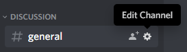
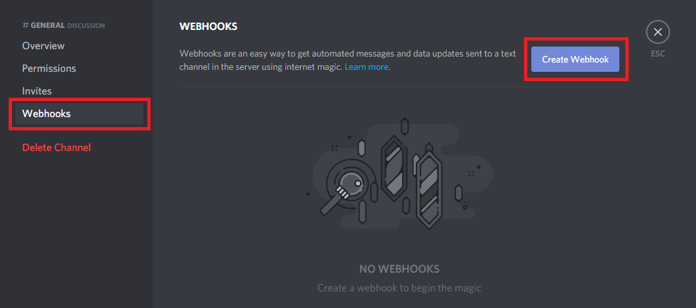
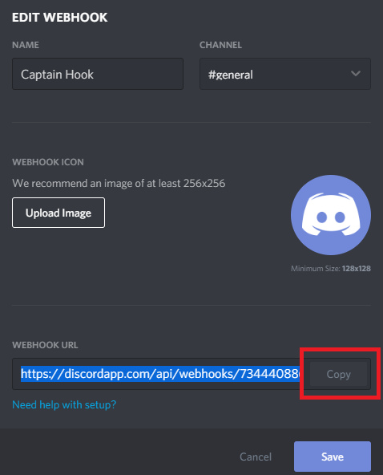
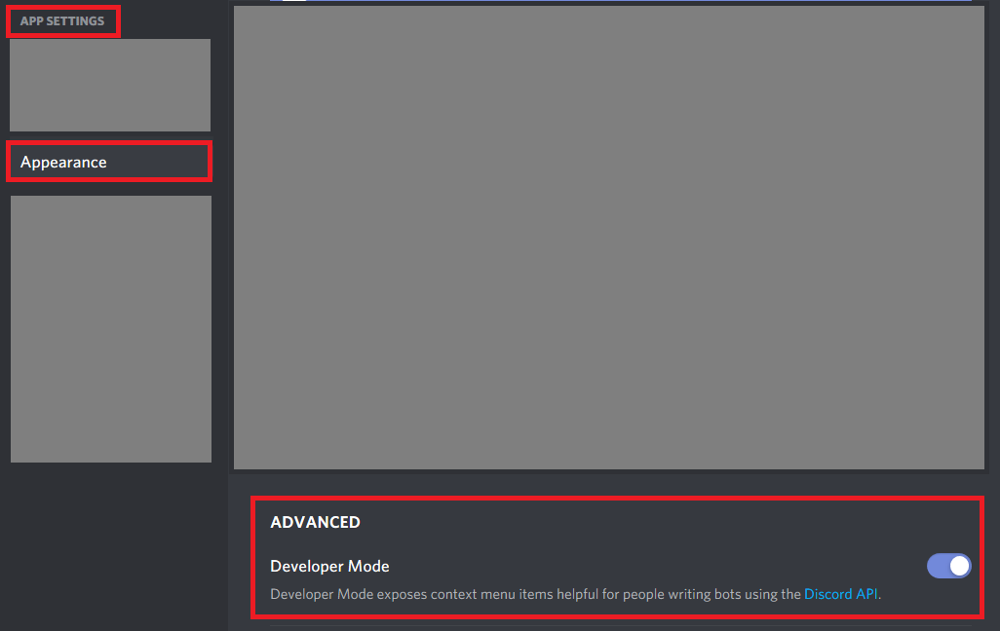
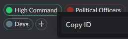
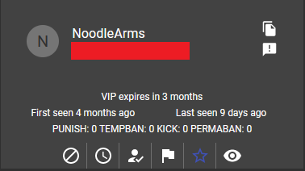

# User Guide

This guide contains information on how to use certain features of the app.
The guide is incomplete and will be expanded in the future.

## Table Of Contents

* [Discord Integration](#Discord-Integration)
* [Expiring VIPs](#expiring-vips)

## Discord Integration

The app is able to forward in-game chat messages and kill log into your
Discord server through Discord webhooks.

To enable Discord Integration features, we'll have to edit the `.env` file
and fill in the custom values for your Discord server.
We're interested in the lines starting with `DISCORD_` in the `.env` file.
Read through the comments above these lines. Comments are the lines starting with `#`.

###### Creating a webhook.

1. Navigate to the channel settings.

    

2. Create a webhook.

    
    
3. Copy webhook URL.

    

###### Finding role IDs.

1. Enable Developer Mode in Discord User Setting.

    
    
2. Copy desired role ID(s).

    

## Expiring VIPs
### Introduction
Many communities fund their servers through billing for VIP access and reward seeders with free VIP access. Maintaining VIP lists can be labor intensive as access has to be manually removed. RCON now has the ability to add an expiration date for players VIP access after which it will automatically be removed.

This is entirely optional, you can disable automatic removal, configure how often expired players are removed and add players with indefinite VIP access.

**Please note** that expiration dates are stored in RCON as [UTC](https://en.wikipedia.org/wiki/Coordinated_Universal_Time) timestamps, when you pick a date/time in your browser it is your local system time and converted when it's sent to RCON. Time zones and daylight savings time are complicated, if you set an expiration timestamp and time zone definitions change, or day light savings happens a players VIP may expire +/- 1 hour different than you expect.

**Please note** that if there are errors, or you add VIP status that is already in the past, or anything weird, they will still be added as VIP on the game server, even if it will be removed the next time expired VIPs are pruned.

### Enabling Expiring VIPs
#### config.yml
If you are upgrading from an older version of RCON you will have to add the `REMOVE_EXPIRED_VIPS` section from `default_config.yml` to your `config.yml`.

If you want expired VIPs to automatically be removed **you have to** set `enabled: true` here.
#### Service
After updating `config.yml` you must also enable the `expiring_vips` service under `Manage services` in your RCON Settings.

### Managing Individual Players
#### History > Players
The easiest way to manage an individual players VIP status is through `History > Players` by clicking on the star on their player tile.

You can either pick a specific date and time through the date picker, or you can use the shortcut buttons (30 days, etc.) to quickly adjust an expiration date. Any changes you make **must** be confirmed before they take effect.

Use the `INDEFINITE VIP` button to add VIP status that won't expire and the `REMOVE VIP` button to remove the players VIP status.

#### Settings > Manage VIPs
An individual player can also be added/deleted through the `Manage VIPs` UI on the `Settings` page but you can't change a players epiration date, only delete their status, or if they don't exist add them with a specific expiration time.

Updating a player is easier to do through `History > Players`.
### Uploading/Downloading a VIP List
A VIP list can be uploaded/downloaded either **with** or **without** expiration time stamps.  You **must** check the `Include Expiration Dates` checkbox if you want to include timestamps with a download, or to parse an uploaded file that includes timestamps.

**Please note** that care should be taken, if you upload a file and the checkbox is not checked, everyone on the list gets VIP status that **never expires** which will overwrite any existing expiration timestamps.

If you upload a file and want to include expiration dates, the expiration date must be the last portion of the line and it must be separated from the players name with whitespace. You should use an [ISO-8601](https://en.wikipedia.org/wiki/ISO_8601) timestamp, but *you should* be able to use anything that can be parsed by Python's [dateutil parser](https://dateutil.readthedocs.io/en/stable/parser.html) can understand.

For example: `12345678912345678 NoodleArms 2023-01-23T11:48:36+00:00`

If you mess up the format, VIP status will still be added if a name and steam ID can be parsed, but they'll be granted VIP status that **never expires**.

### Logging
A `expiring_vips.log` file is created per server and is found in your `./logs` directory. Removal of expired VIPs is logged here.
### Discord Webhooks
An optional webhook is available in `config.yml` which will report to Discord anytime an expired VIP is removed.